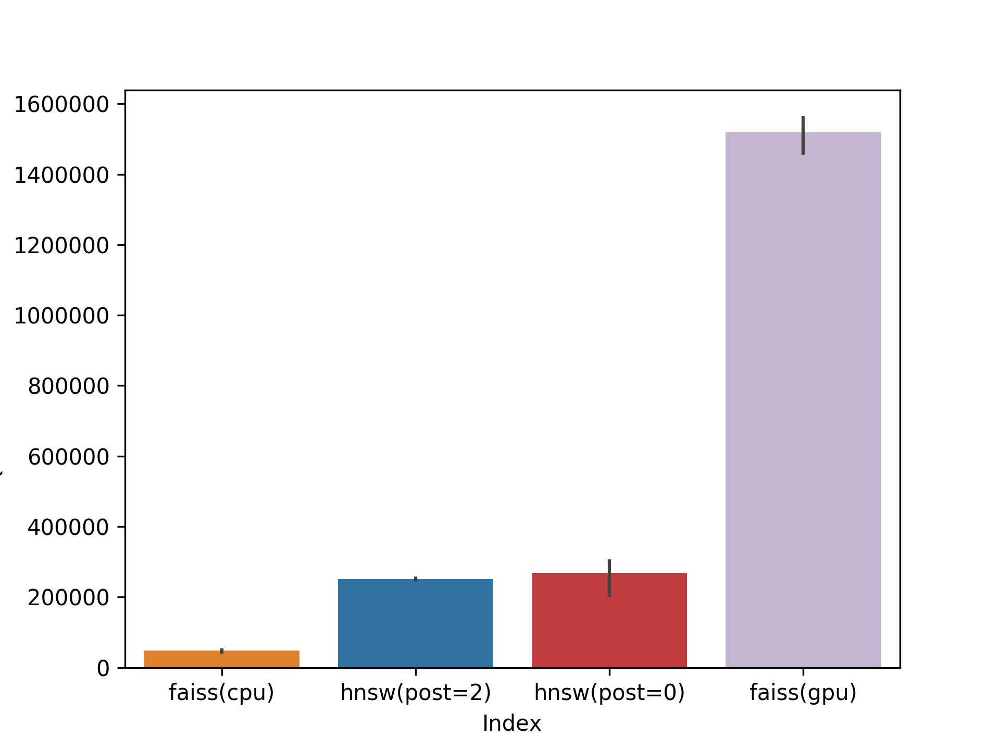
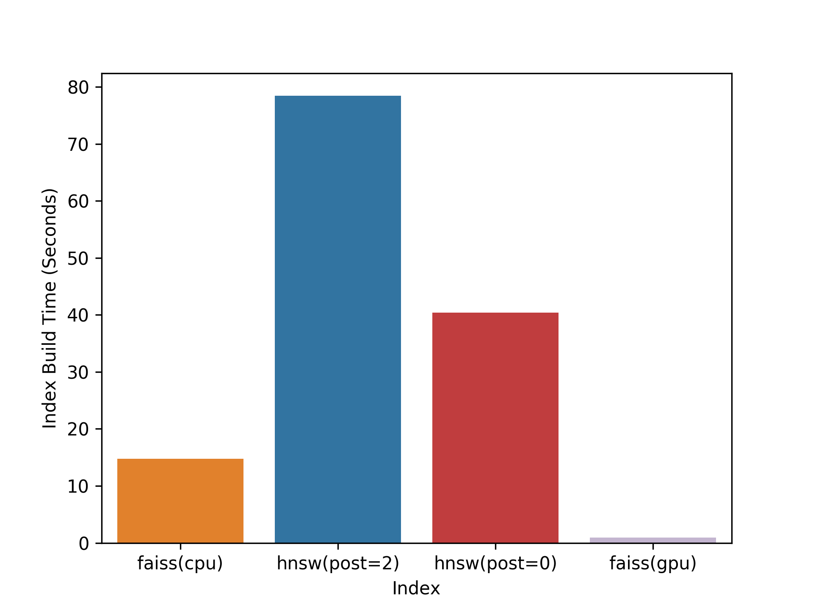

Approximate ALS test code
=======

This folder has extra code for my post on using [approximate nearest neighbour search for
generating recommendations](http://www.benfrederickson.com/approximate-nearest-neighbours-for-recommender-systems/).

This requires both the [implicit](https://github.com/benfred/implicit/) library as well as the
[ann-benchmarks](https://github.com/erikbern/ann-benchmarks) project to run. 

(Note: [my fork of ann-benchmarks](https://github.com/benfred/ann-benchmarks) currently has a couple modifications
that I'm assuming are available for the rest of the instructions here).

Steps to get this all going

1) Run the
[create_ann_benchmarks_data.py](https://github.com/benfred/bens-blog-code/blob/master/approximate_als/create_ann_benchmarks_data.py) to generate a dataset of the implicit MF latent factors
to use in ann-benchmarks, and copy to the 'queries' folder in your ann-benchmarks. This requires the last.fm dataset to be downloaded, and cleaned up as desribed here: 
https://github.com/benfred/implicit/blob/master/examples/lastfm.py#L5

2) Run ann-benchmarks against the generated datafile, doing something like
```python ann_benchmarks/main.py --dataset lastfm50 --algo 'hnsw(nmslib)' --algo faiss --algo annoy```

3) Run the modified plot files here to generate the graphs: 
```python plot.py --input  results/lastfm50.txt```

4) Optionally run the batch cpu/gpu test file: test_batch_queries.py which takes the queries 
generated in step 1 and tests out the GPU implementation of faiss.


The query time output is:



The index time output is:


